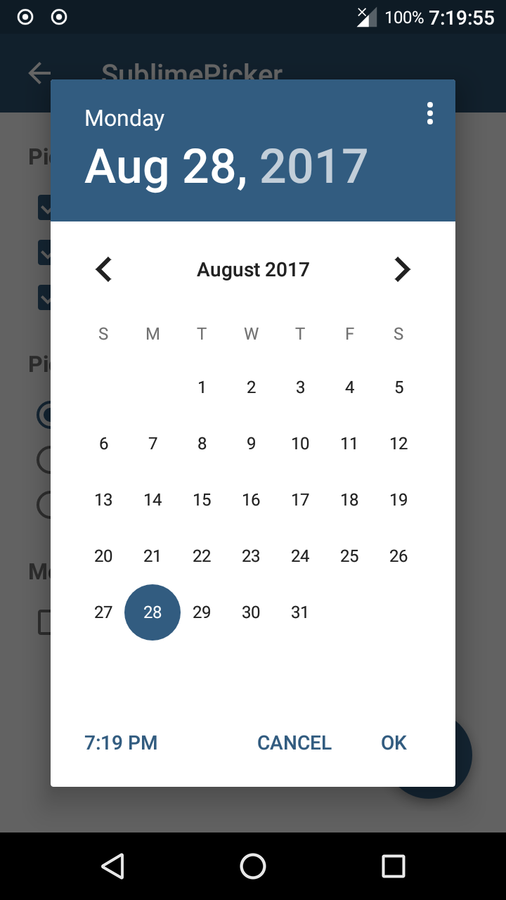
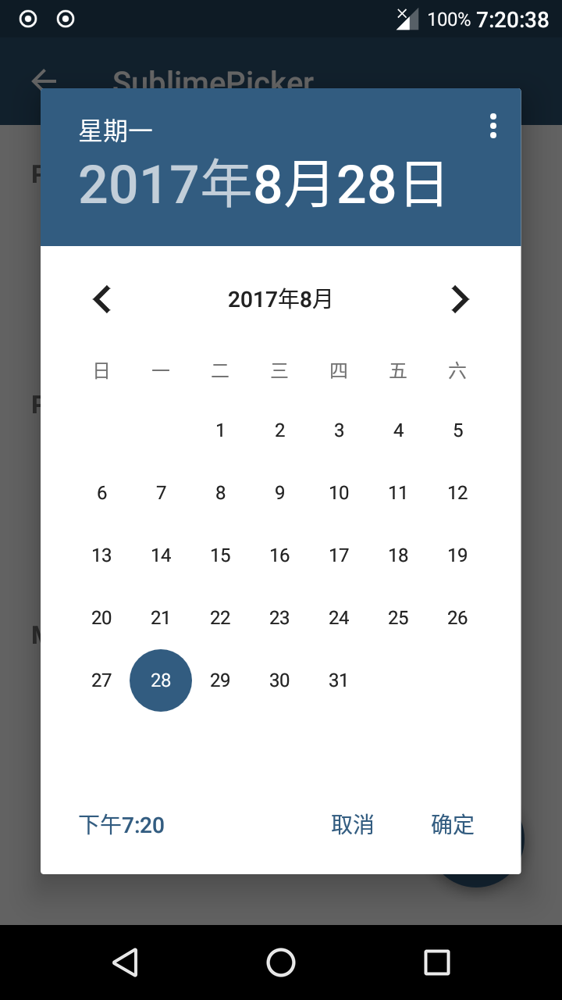
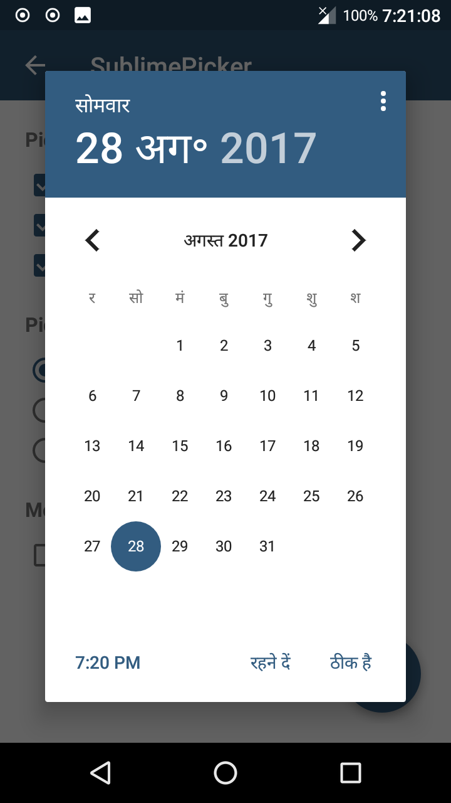

# SublimePicker

A customizable view that provisions picking of a date, time & recurrence option, all from a single user-interface. You can also view 'SublimePicker' as a collection of material-styled (API 23) DatePicker, TimePicker & RecurrencePicker, backported to API 14.

About this fork
---------------
The DatePicker has been modified to use a new date header layout different from that of the native 
platform. The new layout adapts to all locales and represents dates in full as they are written in 
the user's locale. This means the year, month and day are displayed together with equal weight.
This makes the year picker mode more discoverable and affords greater recognition to international 
audiences.

   

Installation
------------
```
allprojects {
    repositories {
        maven { url 'https://jitpack.io' }
    }
}

dependencies {
    compile 'com.github.philliphsu:sublimepicker:3.0-alpha1'
}
```

License
-------
    Copyright (c) 2015 Vikram Kakkar
    Copyright (c) 2017 Phillip Hsu

    Licensed under the Apache License, Version 2.0 (the "License");
    you may not use this file except in compliance with the License.
    You may obtain a copy of the License at

         http://www.apache.org/licenses/LICENSE-2.0

    Unless required by applicable law or agreed to in writing, software
    distributed under the License is distributed on an "AS IS" BASIS,
    WITHOUT WARRANTIES OR CONDITIONS OF ANY KIND, either express or implied.
    See the License for the specific language governing permissions and
    limitations under the License.